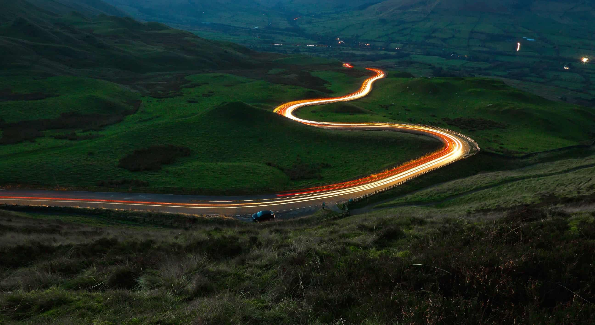

# SliderJS
> A mini javascript library for creating sliders and courousel

## Screenshot


## how to use ?
- copy this style reference inside your html head element.
  
    ```html
    <link rel="stylesheet" href="https://raw.githubusercontent.com/vikas-kukreti/slider-js/master/dist/sliderjs-script-v1.js">
    ``` 

- copy this script just before the end of html body element.
  
    ```html
    <link rel="stylesheet" href="https://raw.githubusercontent.com/vikas-kukreti/slider-js/master/dist/sliderjs-style-v1.css">
    ``` 
- thats how to use it in html documents

    ```html
    <div class="slider" id="slider">
        
        <!-- Every slider-item element is considered a slide -->

        <div class="slider-item">
            <!-- You can embed whatever you want insider this and provide custom styling -->
            
        </div>

        <div class="slider-item">
            
        </div>

        <div class="slider-item">
            
        </div>
        

        <!-- adding buttons for next and prev -->
        <button class="prev">
            <!-- icon for button -->
            <svg xmlns="http://www.w3.org/2000/svg" width="24" height="24" viewBox="0 0 24 24"><path d="M5 3l3.057-3 11.943 12-11.943 12-3.057-3 9-9z"/></svg>
        </button>
        <button class="next">
            <svg xmlns="http://www.w3.org/2000/svg" width="24" height="24" viewBox="0 0 24 24"><path d="M5 3l3.057-3 11.943 12-11.943 12-3.057-3 9-9z"/></svg>
        </button>

        <!-- Slider Background to provide initial height of cool background -->
        
        
        <!-- Span element consist of Swicthes -->
        <span class="switch">
            <!-- dots representing current slider -->
        </span>
    </div>
    ```
- At last it will all look like this

    ```html
    
    <!DOCTYPE html>
    <html>
    <head>
        <link rel="stylesheet" type="text/css" href="res/style.main.css">
        <title>SliderJS Vikas Kukreti</title>
    </head>
    <body>

        <div class="slider" id="slider">
            
            <!-- Every slider-item element is considered a slide -->

            <div class="slider-item">
                <!-- You can embed whatever you want insider this and provide custom styling -->
                
            </div>

            <div class="slider-item">
                
            </div>

            <div class="slider-item">
                
            </div>
            

            <!-- adding buttons for next and prev -->
            <button class="prev">
                <!-- icon for button -->
                <svg xmlns="http://www.w3.org/2000/svg" width="24" height="24" viewBox="0 0 24 24"><path d="M5 3l3.057-3 11.943 12-11.943 12-3.057-3 9-9z"/></svg>
            </button>
            <button class="next">
                <svg xmlns="http://www.w3.org/2000/svg" width="24" height="24" viewBox="0 0 24 24"><path d="M5 3l3.057-3 11.943 12-11.943 12-3.057-3 9-9z"/></svg>
            </button>

            <!-- Slider Background to provide initial height of cool background -->
            
            
            <!-- Span element consist of Swicthes -->
            <span class="switch">
                <!-- dots representing current slider -->
            </span>
        </div>

        <script type="text/javascript" src="res/script.main.js"></script>

    </body>
    </html>

    ```

## Support
- share this library
- contribute to its development
  
### Thank you
🤟 Happy Coding